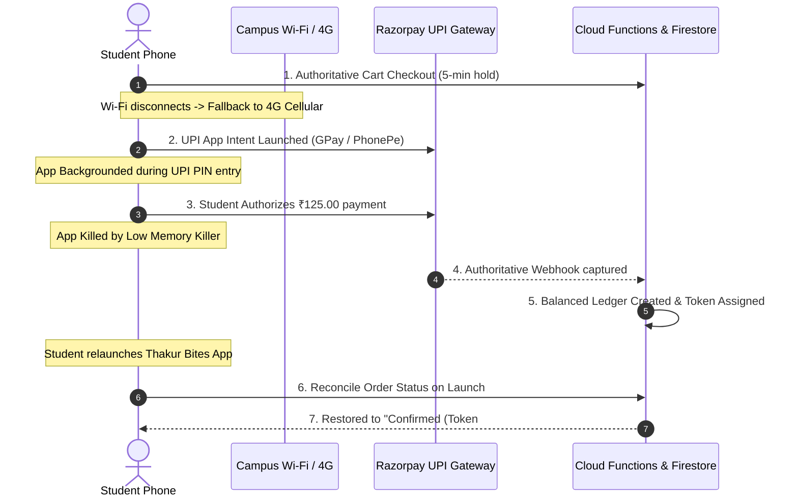

# Thakur College of Engineering & Technology (TCET)
## Real Mobile Device Testing & Network Chaos Resilience Guide

**Document Code**: TCET-TB-DEV-MOB-2026  
**Target Environment**: Campus Staging & Pilot Validation  
**Classification**: Engineering & QA Protocol  

---

## 1. Physical Device Testing Matrix

To guarantee reliable operation across the diverse student demographic at TCET, testing must not be limited to high-end developer phones. Testing must be performed against four distinct hardware profiles:

| Hardware Tier | Representative Devices | Specs | Operating System | Primary Risk Vector |
|---|---|---|---|---|
| **Tier 1: Budget Android** | Redmi 9A, Realme C11, Galaxy A03 | 2GB–3GB RAM, MediaTek Helio | Android 10/11 | Low-memory OS kill, slow WebView |
| **Tier 2: Mid-Range Android** | OnePlus Nord CE, Galaxy M33, Redmi Note 12 | 6GB–8GB RAM, Snapdragon/Exynos | Android 13/14 | Frame drops during fast scrolling |
| **Tier 3: iOS Devices** | iPhone 11, iPhone 13, iPhone SE | 4GB RAM, Apple A-series | iOS 16/17/18 | Safari/WebKit aggressive memory purging |
| **Tier 4: Canteen Tablets** | Samsung Galaxy Tab A8, Lenovo M10 | 3GB–4GB RAM, 10.1" Display | Android 12+ | Thermal throttle, 8-hour continuous screen-on |

---

## 2. Campus Network Chaos & Resiliency Protocols

The TCET campus cafeteria experiences heavy Wi-Fi congestion and packet loss during lunch recess (12:30–13:30 IST) as hundreds of students enter simultaneously.

### Chaos Scenario 1: Wi-Fi to Cellular Handover
* **Procedure**:
  1. Add 2 items to cart while connected to `TCET_STUDENT_WIFI`.
  2. Tap **"Proceed to Checkout"**.
  3. Turn off Wi-Fi on device immediately as the reservation countdown begins.
  4. Device automatically switches to mobile cellular data (Jio / Airtel 4G/5G).
* **Expected Result**:
  - Countdown timer maintains server-authoritative remaining seconds.
  - Cart does not clear or throw unhandled socket exceptions.
  - Razorpay payment sheet launches cleanly on cellular network.

### Chaos Scenario 2: Complete Radio Silence (Deadzone)
* **Procedure**:
  1. Open active checkout screen.
  2. Toggle **Airplane Mode** ON for 20 seconds.
  3. Attempt to tap **"Pay Now"**.
* **Expected Result**:
  - UI displays polite retry banner: *"Network connection interrupted. Retrying..."*
  - Zero duplicate order creation; client awaits network recovery without dropping cart items.
  - Upon Airplane Mode OFF, client revalidates server price and resumes session.

### Chaos Scenario 3: App Force-Kill During Active UPI Redirect
* **Procedure**:
  1. Student selects UPI payment (Google Pay / PhonePe / Paytm).
  2. Razorpay redirects to the external UPI app.
  3. Swipe away / Force Stop the Thakur Bites app while in Google Pay.
  4. Complete the ₹100.00 test PIN authorization in Google Pay.
  5. Re-open Thakur Bites from the home screen.
* **Expected Result**:
  - Webhook has already arrived and committed the double-entry ledger.
  - On app startup, [`reconcileOrderPayment`](file:///Users/adi/thakur%20bites/functions/src/payments.ts) queries the server.
  - App immediately navigates to **Order Tracking Screen** showing `confirmed` with assigned Token Number.
  - Zero loss of student money or token assignment.

---

## 3. Physical Canteen Usability & Ergonomics

Testing on physical devices in the TCET cafeteria must validate practical operational conditions:

1. **Cafeteria Lighting & Glare Readability**:
   - Test KDS tablets and customer phones under high-intensity fluorescent ceiling lights.
   - Contrast ratio for Token Number and Status Pills must exceed **4.5:1 (WCAG AA)**.
2. **Touch Targets for Kitchen Cook Interaction**:
   - Cooks interacting with station tablets have wet or greasy hands.
   - Minimum tap target size on KDS action buttons (`"Start Cooking"`, `"Mark Ready"`) is **$56 \times 56\,\text{dp}$**.
   - Haptic feedback or audio chime confirms ticket status advancement.
3. **Barcode / 2D Scanner Stream Latency**:
   - Test pickup counter camera stream using device rear camera.
   - 4-digit PIN manual fallback must be accessible in 1 tap if QR camera is obscured or dusty.

---

## 4. Acceptance Criteria & Go/No-Go Checklist

- [ ] Zero Application Not Responding (ANR) dialogs on Tier 1 (2GB RAM) devices.
- [ ] 100% of network disconnects during checkout recover cleanly or fail closed.
- [ ] Zero duplicate debits recorded under rapid multi-tap on the payment button.
- [ ] KDS tablet displays zero screen sleep / auto-lock during active shift (Wakelock verified).
