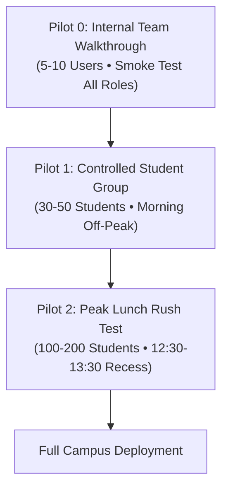
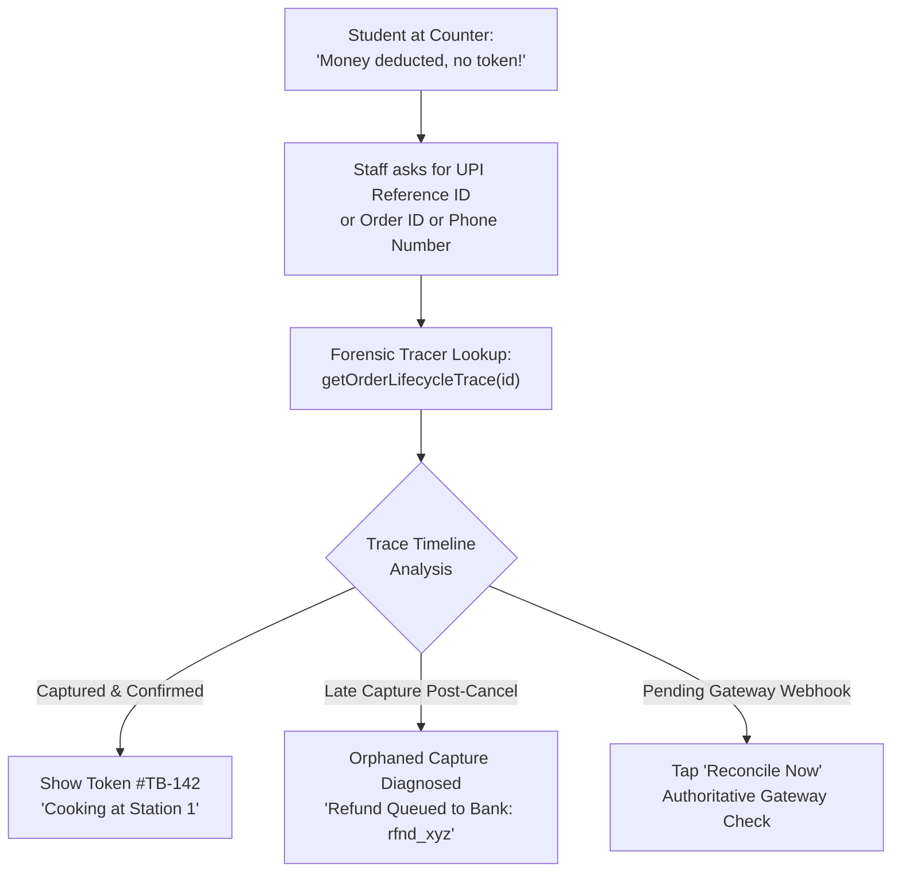

# Thakur College of Engineering & Technology (TCET)
## Physical Campus Pilot Execution Guide & Protocol

**Document Code**: TCET-TB-PILOT-2026-V1  
**Target Venue**: TCET Main Canteen, Ground Floor, Kandivali (E), Mumbai  
**Target Pilot Window**: Autumn 2026  
**Classification**: Official Pilot Execution Procedure  

---

## 1. Staged Human Pilot Architecture

The transition from software verification to live campus operation is executed through a **three-tier staged human pilot**:



---

## 2. Pilot 0: Internal Team Walkthrough (Days 1–2)

### Objective
Verify that all physical hardware, local network connections, and human station roles function harmoniously inside the physical TCET cafeteria space before exposing any students to the system.

### Participant Roster & Role Assignments (8 People)
* **2 Student Testers**: Android (Budget & Mid-range) placing digital orders via Razorpay test mode.
* **1 Faculty Tester**: Fast-track priority order testing.
* **2 Kitchen Cooks**: Operating Station 1 (Hot Snacks) and Station 2 (Beverages) tablets.
* **1 Cashier**: Operating Counter POS terminal for counter-cash testing.
* **1 Canteen Manager**: Monitoring Owner Executive Console and feature flags.
* **1 DevOps / SRE Lead**: Monitoring real-time Cloud Functions logs and Firestore locks.

### Step-by-Step Drill Script
1. **08:30 IST**: Power on Dining Hall 55" TV and launch `/publicLiveQueue` full-screen kiosk.
2. **08:45 IST**: Cashier opens shift using 4-digit Workstation Shift PIN.
3. **09:00 IST**: 10 simultaneous orders placed:
   - 6 Online UPI Orders (Samosas, Dosas, Sandwiches).
   - 2 Counter-Cash Orders (Cashier enters order $\to$ collects cash $\to$ prints token).
   - 2 Faculty Priority Orders.
4. **09:10 IST**: Cooks claim orders on KDS $\to$ tap `"Preparing"` $\to$ tap `"Ready"`.
5. **09:15 IST**: TV displays tokens in `"Now Preparing"` and moves to `"Ready for Pickup"`.
6. **09:20 IST**: Testers arrive at pickup counter $\to$ present 4-digit PIN $\to$ staff enters PIN $\to$ order marks `"Collected"`.
7. **09:30 IST**: Testers submit 5-star meal ratings on the mobile app.

### Exit Gate Criteria (Pilot 0)
- [ ] 100% of orders successfully reach `collected` state without database deadlocks.
- [ ] TV display updates within $< 2\text{ seconds}$ of state transition without full-page reloads.
- [ ] Cashier drawer expected cash equals system ledger cash to ₹0.00 accuracy.

---

## 3. Pilot 1: Controlled Student Group (Days 3–4)

### Objective
Expose the platform to real TCET students in a controlled, non-peak environment to evaluate checkout clarity, payment success rates, and kitchen throughput.

### Scope & Constraints
* **Target Cohort**: 35 Selected Students from Information Technology (TE-IT) Class.
* **Execution Window**: 10:15 AM – 11:00 AM (Morning Tea Recess).
* **Order Cap**: Maximum 15 orders per 10-minute interval (enforced by reservation rate limiter).
* **Payment Mode**: Live Razorpay UPI / RuPay + Cash Counter.

### Monitored Operational Metrics
| Metric | Pilot 1 Target | Warning Level | Action on Breach |
|---|---|---|---|
| **Checkout Success Rate** | $\ge 98\%$ | $< 95\%$ | Inspect network packet loss / UPI app drops |
| **Average Prep Time** | $< 8\text{ mins}$ | $> 12\text{ mins}$ | Adjust kitchen batching guidelines |
| **Pickup Handover Time** | $< 30\text{ secs}$ | $> 60\text{ secs}$ | Add dedicated queue lane for mobile pickups |
| **Ledger Balance** | ₹0.00 Discrepancy | Any | Halt new checkouts immediately |

### Student Usability Survey (Post-Order)
Each student completes a 3-question survey upon receiving food:
1. *Was ordering and UPI payment seamless?* (1–5 Stars)
2. *Did the TV display clearly notify you when food was ready?* (Yes/No)
3. *Did staff verify your PIN quickly at pickup?* (Yes/No)

---

## 4. Pilot 2: Peak Lunch Rush Stress Test (Day 5)

### Objective
Prove that Thakur Bites thrives under the primary TCET campus lunch rush when hundreds of students flood the canteen simultaneously.

### Execution Window
* **Time**: 12:30 PM – 01:30 PM IST (Official Lunch Recess).
* **Expected Volume**: 120–180 live orders.
* **Campus Audience**: Entire Computer Engineering & IT departments (~250 eligible students).

### Physical Cafeteria Queue Management
```text
┌────────────────────────────────────────────────────────┐
│                   MAIN CANTEEN COUNTERS                │
│                                                        │
│  ┌───────────────────────────┐  ┌────────────────────┐ │
│  │ Counter A: DIGITAL PICKUP │  │ Counter B: CASH/POS│ │
│  │ (Pre-ordered food pickup) │  │ (Traditional Cash) │ │
│  └─────────────┬─────────────┘  └──────────┬─────────┘ │
│                │                           │           │
│         [Fast Pickup Lane]          [Slow Cash Queue]  │
│                │                           │           │
│        ═════════════════           ═════════════════   │
│         Physical Barrier            Physical Barrier   │
└────────────────────────────────────────────────────────┘
```

### Anti-Starvation Fair Queue Verification
During Pilot 2, the DevOps lead verifies that students who ordered 20 minutes ago are not starved by newer faculty priority orders:
$$\text{Priority Score} = \text{Role Weight} + (\text{Wait Time (mins)} \times 1.5)$$
When student wait time exceeds 20 minutes, their score systematically overtakes fresh teacher orders, ensuring fair kitchen progression.

### Fallback Procedures (Safety Net)
If campus Wi-Fi completely collapses during the peak rush:
1. Manager presses **"Switch to Counter Mode"** on smartphone.
2. App directs students: *"Digital ordering paused. Please order at Counter B."*
3. Cooks fulfill already-paid kitchen orders using safe-harbor handover protocols.
4. Zero students lose money; zero cooked meals are wasted.

---

## 5. Sign-Off & Campus Go-Live Authorization

Upon successful completion of Pilot 2, the following stakeholders must sign the production readiness certificate:

1. **Canteen Head Contractor / Manager**: Confirms staff proficiency and cash reconciliation accuracy.
2. **Student Council Representative**: Confirms student satisfaction score $\ge 4.5 / 5.0$.
3. **TCET IT Infrastructure Lead**: Confirms network and display kiosk stability.
4. **Lead Software Engineer (Aadi)**: Confirms 0 unresolved critical anomalies and 100% balanced financial ledgers.

---

## 6. Five-Second Student Dispute Resolution Playbook (Correlation ID)

### Problem Scenario
A student arrives at Counter B stating:
> *"₹120 was deducted from my Google Pay / PhonePe bank account, but the app didn't give me a token!"*



### Action Protocol
1. **Request Identifier**: Staff asks student to show the UPI transaction receipt on Google Pay / PhonePe. Copy the Razorpay Payment ID (`pay_...`) or Order ID (`order_...`).
2. **Execute Forensic Lookup**: Open Manager Console $\to$ **"Order Lifecycle Forensic Search"** and paste the identifier (calls `getOrderLifecycleTrace`).
3. **Instant Timeline Analysis ($< 5\text{ seconds}$)**:
   - **Case A: Order Confirmed**: If the timeline shows `WEBHOOK_RECEIVED` $\to$ `ORDER_CONFIRMED`, inform the student:
     > *"Your order was confirmed under Token #TB-142. It is currently being cooked at the Hot Snacks station."*
   - **Case B: Orphaned Payment (Auto-Refund Queued)**: If the timeline shows `ORDER_CANCELLED` $\to$ `ORPHANED_PAYMENT_CAPTURE`, inform the student:
     > *"Your session expired before payment reached us. A full automatic refund of ₹120 has been dispatched to your UPI account. Refund Reference: rfnd_9a2f1b."*
   - **Case C: Delayed Webhook**: If the timeline shows `PAYMENT_INITIATED` without capture, tap **"Reconcile Order Now"**. The backend queries Razorpay directly, captures the payment, logs the ledger, and generates the student's token on the spot.

---

## 7. Order Success Conversion Funnel & Drop-Off Diagnosis

During Pilot 0 and Pilot 1, the DevOps team monitors the 9-stage conversion funnel in real-time via `getOrderSuccessFunnel()`:

$$\text{Order Success Rate} = \frac{\text{Food Picked Up}}{\text{Checkout Started}} \times 100$$

### Funnel Drop-Off Diagnosis Guide
* **Drop at `Payment Started` $\to$ `Payment Successful` ($> 8\%$ drop)**:
  - *Diagnosis*: Payment gateway or UPI intent failure.
  - *Action*: Ensure college Wi-Fi is not blocking Razorpay payment sockets; verify UPI deep-link intent fallback on student devices.
* **Drop at `Food Ready` $\to$ `Food Picked Up` ($> 5\%$ drop)**:
  - *Diagnosis*: Students are unaware their food is ready.
  - *Action*: Elevate smart TV chime volume; verify push notifications or SMS alerts are dispatching promptly.

---

## 8. Pilot Feedback Collection Instruments

### Student Post-Meal Survey (30 Seconds)
Displayed automatically on the Flutter mobile app upon order collection:
* **Star Rating**: ★★★★★ (1 to 5 Stars)
* **Quick Reason Pills**:
  - `payment_seamless` (UPI was fast)
  - `great_experience` (Smooth & hot food)
  - `payment_problem` (UPI dropped or retried)
  - `app_confusing` (UI was hard to navigate)
  - `order_delayed` (Food took $> 15$ mins)
  - `food_not_found` (Item was missing)
* **Optional Comment**: 1 sentence box (max 280 characters).

### Canteen Staff Retrospective (End of Shift)
Completed on the KDS tablet or printed paper rubric:
1. *Station Screen Clarity*: 1 to 5 (Were tickets easy to read while cooking?)
2. *Queue Volume*: `Too Fast` / `Manageable` / `Slow`
3. *Kitchen Blockers*: Free-text field for cooks to report recipe bottlenecks, fryer delays, or tablet placement issues.

