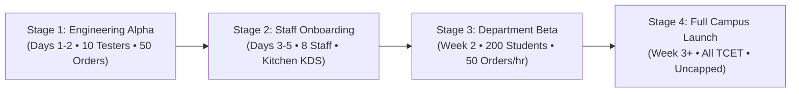

# Thakur College of Engineering & Technology (TCET)
## Thakur Bites: Campus Pilot Launch & Operations Runbook

**Document Code**: TCET-TB-OPS-2026-V1  
**Project**: Thakur Bites Canteen Management Platform  
**Target Venue**: TCET Main Canteen, Ground Floor, Thakur Educational Campus, Kandivali (E), Mumbai  
**Target Go-Live**: Autumn 2026  
**Classification**: Official Operational Runbook & Launch Protocol  

---

## 1. Executive Summary & Rollout Strategy

Thakur Bites transitions the TCET canteen from manual physical token queues to an automated, server-authoritative digital ordering system with:
1. Zero-PII public TV queues for cafeteria displays.
2. Anti-starvation kitchen scheduling prioritizing prolonged student waiting orders.
3. Millisecond-accurate offline cart reconciliation and server-authoritative checkout.
4. Double-entry financial accounting with Razorpay UPI and counter-cash settlement.
5. Autonomous 3-tier circuit breakers protecting system integrity during campus rush hours.

The rollout is executed through a **4-stage progressive pilot** designed to build staff confidence, tune kitchen throughput, and validate infrastructure reliability under authentic peak loads.

---

## 2. Four-Stage Progressive Campus Rollout Plan



### 🟢 Stage 1: Engineering Alpha (Days 1–2)
* **Audience**: 5 Developer Core Team + 5 Selected TCET Student Council Testers.
* **Environment**: Staging (`adi-thakur-bite` with staging seed dataset).
* **Target Volume**: 50 end-to-end orders across Android, iOS, and Mobile Web.
* **Mandatory Validation Scenarios**:
  - Offline cart persistence across browser refreshes and mobile app backgrounding.
  - Airplane mode toggling during active checkout flow.
  - Forced app kill during Razorpay UPI payment redirect $\to$ auto-reconciliation.
  - 4-digit pickup PIN handover verification and replay rejection.
* **Exit Gate**: 100% orders captured on ledger with zero orphaned reservations.

### 🟡 Stage 2: Canteen Staff & Kitchen Onboarding (Days 3–5)
* **Audience**: 6 Kitchen Cooks + 2 Cashier Counter Staff + 1 Canteen Head Manager.
* **Hardware Setup**:
  - Station 1 (Hot Snacks / Grill): 10.1" Android Tablet running KDS station filter.
  - Station 2 (Beverages / Juices): 10.1" Android Tablet running KDS station filter.
  - Counter 1 & 2: POS Touchscreens running Cashier Counter View.
  - Central Cafeteria: 55" Smart TV displaying `/publicLiveQueue` in full-screen kiosk mode.
* **Staff Hands-On Drills**:
  1. *Cook Workflow*: Claiming tickets $\to$ marking `preparing` $\to$ marking `ready`.
  2. *Cashier Workflow*: Receiving counter cash $\to$ instant token generation $\to$ ledger capture.
  3. *Handover Workflow*: Student presents 4-digit PIN $\to$ staff enters PIN $\to$ order marks `collected`.
  4. *Out of Stock Toggle*: Immediate toggle on manager console when Samosas / Pav Bhaji runs out.
  5. *Safe-Harbor Food Handover Drill*: Handing over already-cooked meals during a simulated circuit breaker freeze.
* **Exit Gate**: Kitchen staff completes 30 mock orders with $< 15\text{s}$ average interface interaction time.

### 🟠 Stage 3: Department Beta (Week 2 — 5 Days)
* **Audience**: Information Technology & Computer Engineering Departments (~200 active students & faculty).
* **Operating Hours**: 10:00 AM – 02:00 PM IST.
* **Rate Limits & Caps**: Capped at 50 digital orders per 30-minute block to prevent kitchen backpressure.
* **Payment Gateways**: Razorpay Live Mode (UPI, RuPay, Netbanking) + Counter Cash.
* **SLI / SLO Monitoring Thresholds**:
  - $p_{50}$ Checkout Latency $< 500\text{ms}$
  - $p_{95}$ Checkout Latency $< 2000\text{ms}$
  - Payment Reconciliation Delay $< 60\text{s}$
  - Unbalanced Ledger Anomalies $= 0$
* **Exit Gate**: 5 consecutive days of zero financial discrepancies and $> 98\%$ checkout success rate.

### 🔴 Stage 4: Full TCET Campus Launch (Week 3 onwards)
* **Audience**: All 4,500+ TCET Students, Faculty, Administrative Staff, and Visitors.
* **Operating Hours**: 07:30 AM – 06:30 PM IST.
* **Capacity**: Uncapped; auto-scaling Cloud Functions with Firestore concurrency reservation locks.
* **Real-Time Features**:
  - Live TV Queue active in main dining hall.
  - Anti-starvation fair queue automatically escalating waiting student orders over newer faculty orders after 20 minutes.
  - Continuous background integrity monitor running every 5 minutes.

---

## 3. Daily Operational Checklists & Runbooks

### 🌅 1. Morning Opening Protocol (07:30 – 08:00 IST)
**Responsible**: Canteen Head Manager & Operations Lead

- [ ] **Power & Connectivity Check**:
  - Verify Canteen Wi-Fi router `TCET_CANTEEN_STAFF_5G` is operational.
  - Power on Kitchen Tablets (Hot Snacks, Beverages) and ensure 100% battery / plugged in.
  - Power on Central Dining Hall TV; load public display URL: `https://adi-thakur-bite.web.app/queue`.
- [ ] **Inventory & Stock Reconciliation**:
  - Open Thakur Bites Manager Console.
  - Input initial daily preparation counts (e.g., Samosas: 300, Vada Pav: 250, Sandwiches: 150).
  - Verify all unavailable items from previous night are accurately toggled or restocked.
- [ ] **System Health Probe**:
  - Run opening sanity check script:
    ```bash
    node scripts/seed_environment.js --env=production --dry-run
    ```
  - Verify Operational Status banner reads: `NORMAL_OPERATIONS (HEALTHY)`.

---

### ⚡ 2. Peak Rush Hour Playbook (12:00 – 13:45 IST)
**Context**: 1,200+ students dismiss simultaneously during primary lunch recess. High order concurrency.

* **Kitchen Display System (KDS) Management**:
  - Tickets are color-coded:
    - 🟢 Green: Waiting $< 5$ minutes.
    - 🟡 Yellow: Waiting $5 - 10$ minutes.
    - 🔴 Red (Pulsing): Waiting $> 15$ minutes (Anti-starvation queue escalation).
  - Cook must tap tickets in FIFO order; red tickets must be prepared immediately.
* **Pickup Counter Protocol**:
  - 2 Dedicated Staff at Counter A (Hot Snacks) and Counter B (Beverages).
  - When student arrives, staff asks: "What is your 4-digit PIN?"
  - Staff enters PIN into tablet $\to$ Green checkmark displays $\to$ Food is handed over.
  - If tablet displays Red Cross: "Invalid PIN or Already Collected" $\to$ Direct student to Manager Desk immediately. Do NOT hand over food on failed verification.
* **High-Contention Inventory Exhaustion**:
  - If a snack sells out physically before digital stock hits zero, manager presses **"Emergency Item Stop"** on the dashboard.
  - In-flight carts attempting to checkout that item receive: `"Item sold out. Removed from cart."` without taking payment.

---

### 🌙 3. Evening Close & Financial Settlement (17:30 – 18:30 IST)
**Responsible**: Head Cashier & Finance Officer

- [ ] **Lock Ordering**:
  - Manager toggles Store Status to `CLOSED` on the Owner Console.
  - Public TV queue clears remaining completed tokens.
- [ ] **Cash Drawer Audit**:
  - Count physical cash in Counter 1 and Counter 2 drawers.
  - Run daily POS cash report:
    - Expected Cash $= \sum \text{Counter Cash Ledgers for Date}$.
    - Compare Physical Cash against System Expected Cash.
    - Acceptable Discrepancy Tolerance: ₹0.00.
- [ ] **Gateway Payout Reconciliation**:
  - Inspect Razorpay Settlement Report vs Thakur Bites `GATEWAY_RECEIVABLE` ledger.
  - Verify all captured transactions match 1:1 with `confirmed` or `collected` orders.
- [ ] **Integrity Scan Verification**:
  - Verify `integrityAnomalies` collection has zero open `ACTIVE` issues.

---

## 4. Emergency & Incident Response Protocols

### Scenario A: Campus Wi-Fi Network Outage
1. **Immediate Fallback**:
   - Kitchen tablets and Counter POS automatically failover to secondary 4G LTE SIM backup hotspots (`TCET_BACKUP_4G`).
2. **Extreme Outage (Zero Internet)**:
   - Cashiers revert to paper token books stamped with date.
   - Manager toggles app to `EMERGENCY_MAINTENANCE` via cellular phone browser.
   - When connection returns, manual cash batches are entered via Manager Batch Reconcile.

### Scenario B: Circuit Breaker Level 2 (`DEGRADED`)
* **Trigger**: Checkout error rate $> 10\%$ or Razorpay gateway experiencing downtime.
* **System Action**: Mobile app disables online Razorpay checkouts; displays: *"Digital payments temporarily paused. Please order at Canteen Counter."*
* **Staff Action**: Direct students to physical cashiers. Existing paid kitchen orders continue cooking and handing over normally.

### Scenario C: Circuit Breaker Level 3 (`FINANCIAL_FROZEN`)
* **Trigger**: Double-entry ledger mismatch or detected database tampering.
* **System Action**: Complete shutdown of new orders and payment processing.
* **Safe-Harbor Food Rule**: All food already in status `preparing` or `ready` **MUST BE COOKED AND HANDED OVER TO STUDENTS**. Never deny food to a student whose order was already paid and confirmed before the incident.
* **Unfreeze Protocol**: Requires two distinct system administrators using Four-Eyes authentication to resolve the root cause before unfreezing.

---

## 5. Contact Directory & Escalation Matrix

| Role | Contact Name | Channel / Phone | Escalation Responsibility |
|---|---|---|---|
| **Canteen Head Manager** | Shri R. Sharma | Extension 4102 | Daily kitchen & counter operations |
| **DevOps & Backend Lead** | Aadi (Lead Dev) | PagerDuty / Slack `#tb-ops` | Cloud Functions, Gateway, Firestore |
| **TCET IT Infrastructure** | Campus Network NOC | Extension 2200 | Wi-Fi, Ethernet, TV kiosk uptime |
| **Campus Security Desk** | Ground Floor Security | Extension 1000 | Crowd control during lunch recess |
| **Razorpay Priority Support** | Merchant Account Mgr | `merchants@razorpay.com` | Payment gateway API or UPI rail issues |
